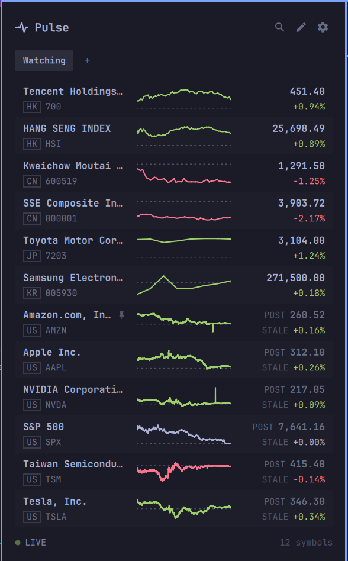

# Pulse for Omarchy

**Glanceable market data in the Omarchy bar.**

**Original app:** [Pulse for macOS](https://github.com/fatwang2/Pulse) · **Website:** [www.pulseticker.app](https://www.pulseticker.app/)



A port of [Pulse](https://github.com/fatwang2/Pulse) — the macOS menu-bar
market watcher — to the Omarchy shell. Same idea, same data model: see how the
symbols you care about are doing in the shortest possible time, without leaving
what you are working on. It is a market watcher, not a trading terminal.

## Requirements

- Omarchy 4 (the Quickshell-based `omarchy-shell`)
- Internet access

There is no account, no API key and no daemon. Quotes come from public
endpoints, and the plugin says which source and what delay is behind every
number.

## Install

```bash
omarchy plugin add https://github.com/fatwang2/omarchy-pulse.git --enable
```

For development, symlink this checkout into Omarchy instead:

```bash
./install.sh          # add --no-restart to leave the running shell alone
```

Either way the first install seeds a starter watchlist at
`~/.config/omarchy/pulse/watchlist.json` and never touches it again.

To remove the plugin:

```bash
omarchy plugin remove pulse.omarchy
```

Your watchlist file stays behind; delete `~/.config/omarchy/pulse/` if you
want that gone too.

## The watchlist

The panel follows the macOS popover: named lists as tabs, the magnifier to
add, the pencil to edit — reorder, pin, remove — and the gear for how the
plugin behaves; a row opens its quote detail. Everything writes
`~/.config/omarchy/pulse/watchlist.json`, which any text editor can edit too —
changes from either side land without restarting the shell.

```json
{
  "version": 2,
  "lists": [
    { "name": "Watching", "symbols": ["AAPL", "NVDA", "^GSPC"] },
    { "name": "HK", "symbols": ["00700.HK", "^HSI"] }
  ],
  "activeList": "Watching",
  "pollIntervalSeconds": 60,
  "barDisplay": "icon",
  "pinnedSymbol": "NVDA",
  "carouselIntervalSeconds": 6
}
```

A version-1 file (a bare `symbols` array) is migrated to one list on first
read. The file stays the source of truth because the settings panel Omarchy's
manifest schema is designed for does not exist yet — `barWidget.schema` is
registered into the widget registry and read by nothing in 4.0.0. When it
ships, the scalar options can move into it; ordered lists of instruments
cannot, which is why the panel edits the file.

| Key | What it does |
|---|---|
| `lists` | Named watchlists; each holds `name` and ordered `symbols` |
| `activeList` | Which list the panel opens on |
| `pollIntervalSeconds` | Refresh cadence, clamped to 15–3600 |
| `barDisplay` | `icon` (discreet), `pinned` (one quote in the bar), `carousel` (rotates) |
| `pinnedSymbol` | Which symbol `pinned` shows; read across every list |
| `carouselIntervalSeconds` | How long each symbol holds the bar in `carousel` |

### Writing symbols

A symbol is written the way Pulse writes it: an exchange code with a market
suffix, and no suffix for the US.

| Market | Form | Example |
|---|---|---|
| US | bare ticker | `AAPL`, `BRK-B` |
| Hong Kong | `.HK` | `00700.HK` (stored as `700.HK`) |
| Shanghai / Shenzhen | `.SH` / `.SZ` | `600519.SH`, `300750.SZ` |
| Tokyo | `.T` | `7203.T` |
| Korea | `.KS` (KOSPI) / `.KQ` (KOSDAQ) | `005930.KS`, `035720.KQ` |
| Indices | semantic code or a vendor spelling | `^GSPC`, `SPX`, `INX`, `^HSI`, `N225` |
| Metals | contract code | `GC`, `SI`, `PL`, `PA` |

The Korean board is part of the address and cannot be derived from the code —
`035720` is KOSPI even though its neighbours are not — so `.KS` and `.KQ` name
different things and are not interchangeable.

A code that cannot resolve is dropped rather than kept as a row that can never
quote, so a typo shows up as a missing row, not a permanently blank one.

## Reading the panel

- Rows follow the schedule, the way the macOS app orders them: markets group
  into blocks and the session trading now leads — Asia through the Beijing
  day (HK, China A, Japan, Korea, US), the US after 17:00 Beijing — with
  metals and crypto, which never close, always behind the session-bound
  blocks. Pinning a row (edit mode → pin) raises it to the top of its own
  market block, not the top of the list. Your saved order is never touched;
  it stays the tiebreak inside every block, and **Settings → Order** turns
  the schedule off entirely.
- The identity column is capped so the session line gets the width. An elided
  name shows in full after pointing at it for a moment.
- Each priced row carries the current session's intraday line. It comes from
  the same Yahoo chart response as the quote, so it adds no request or delay.
- Both Chinese boards share one `CN` badge and both Korean boards share `KR`;
  which board a symbol sits on is already in its suffix.
- `LIVE` / `LOADING` / `OFFLINE` sits where a refresh button would be. The
  panel either has current prices or says why it does not.
- `STALE` means a price has stopped arriving **while its market is open**, past
  the source's own delay. A closed market's last print is the close — final,
  not stale — and is never marked.
- Press `/` (or `f`, `a`) to search, `e` to edit, `r` to refresh, `s` for
  settings, `1`–`9` to switch lists, `↑`/`↓` to move, `Enter` for the quote
  detail, `Esc` to back out.
- Lists keep the macOS group bar's functions: "+" becomes an inline name
  field so a list is born with its name, a double click renames a tab in
  place, and hovering a tab reveals its delete.
- Editing the list is a mode, entered from the header's pencil (or `e`).
  While it is on, every row grows move-up, move-down, pin and remove at its
  right edge, the tabs sit disabled, and the rows show your saved order —
  the schedule is bypassed so the arrows edit exactly the sequence you see.
  Esc, the pencil, or back ends it. Nothing appears on hover: reading the
  list and editing the list are different postures.
- The quote detail carries the chart at reading size: the session line
  (`1D`, from the same response as the quote) and daily / weekly / monthly
  candlesticks with a volume strip (`D` / `W` / `M`, fetched on first look
  and cached for ten minutes).

## Adding symbols

Search is a page, as on macOS: the magnifier (or `/`) swaps the watchlist
for it, with the tabs staying live above — results add to the active list,
and switching lists returns to it. An empty query shows your recent
searches as chips (kept in the config file, last eight); adding a symbol
records the query and keeps the page open so several can land in one visit.
A new symbol joins at the top: first in the list, which under the schedule
view means the top of its own market block — beneath that block's pins.

Search matches names and tickers through Yahoo's index. A code that names its
venue — `600519.SH`, `7203.T`, `00700.HK`, `^GSPC` — is resolved locally and
offered whether or not the index knows it, which matters twice: Yahoo spells
Shanghai `.SS` rather than `.SH`, and it answers HTTP 400 to Chinese, Japanese
and Korean queries outright. `茅台` finds nothing there, but `600519.SH` works.

A bare US ticker is left to the index on purpose: `nvidia` is a valid
ten-character US code as far as the symbol layer is concerned, and offering it
would put a row on the list that can never quote.

Venues Pulse does not model are dropped rather than guessed at, so a Frankfurt
or London listing never joins the watchlist under a US badge.

## Data

Quotes come from Yahoo Finance's chart endpoint, covering US, Hong Kong,
Shanghai, Shenzhen, Tokyo, both Korean boards and the COMEX/NYMEX metal
contracts. US symbols are read over an extended-session window, so a pre- or
post-market price shows as such and is measured against the regular close
rather than yesterday's.

Delay is per market and is shown in the quote detail: the US is real time,
Hong Kong and the Chinese boards about fifteen minutes, Tokyo and Seoul about
twenty, the metal contracts about ten.

Requests are serialised one symbol per second, and a closed market is not
polled at all. A twenty-symbol watchlist therefore refreshes over twenty
seconds and never trips the rate limit.

### Not yet wired

The macOS app routes across several sources; this port currently ships one.
Still to come: crypto through Binance (including the 1-second websocket
ticker), spot precious metals and the Shanghai Gold Exchange, Korean real-time
and Korean-language search through Naver, the Sina and Tencent providers,
Longbridge real-time for HK/US/A-shares, and position tracking. The
symbol layer already models all of them, which is why `BTC/USDT` and `XAU`
parse but are refused by the Yahoo adapter rather than quietly priced off the
wrong instrument.

## IPC

```bash
omarchy-shell pulse.omarchy toggle
omarchy-shell pulse.omarchy refresh
omarchy-shell pulse.omarchy status   # symbols, quote count, per-row errors, feed state

omarchy-shell pulse.omarchy settings          # toggle the settings view
omarchy-shell pulse.omarchy add 7203.T        # -> added | rejected
omarchy-shell pulse.omarchy remove TSM        # -> removed | not on the list
omarchy-shell pulse.omarchy find nvidia       # run the add search
omarchy-shell pulse.omarchy results           # what that search returned
omarchy-shell pulse.omarchy lists             # the named lists
omarchy-shell pulse.omarchy selectList HK     # switch the active tab
omarchy-shell pulse.omarchy detail AAPL       # open one row's detail
omarchy-shell pulse.omarchy chartPeriod week  # switch the detail chart
omarchy-shell pulse.omarchy edit              # toggle edit mode
```

`add` and `remove` write the same file the settings view does, so they are also
how a script keeps a watchlist in sync with something else.

## Development

```bash
make test       # JavaScript reducers and source regression checks
make validate   # the above, plus qmllint and omarchy plugin validate
```

`qmllint` cannot resolve `qs.Ui` and `qs.Commons` outside the quickshell
runtime; those import warnings are expected and the first-party Omarchy plugins
produce them too.

See [AGENTS.md](AGENTS.md) for the working agreements — theming rules, why the
data layer is a port rather than a rewrite, and how the JavaScript modules are
shared between QML and Node.

## License

MIT. See [LICENSE](LICENSE) and [NOTICE](NOTICE).
